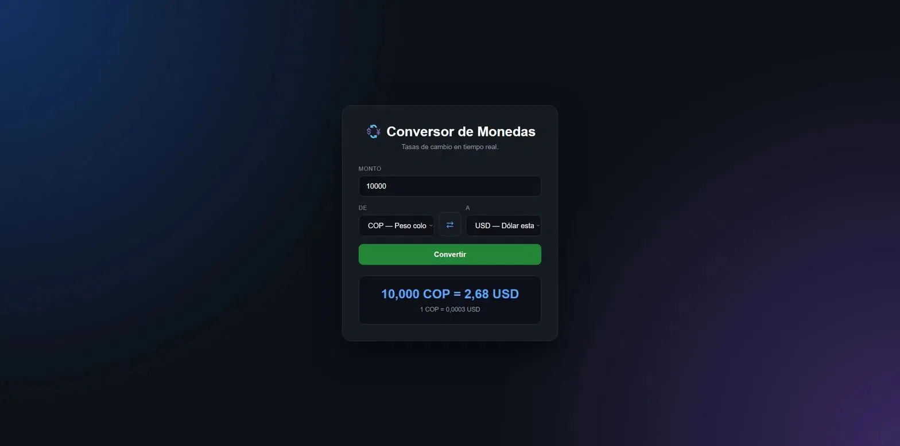

# 💱 Conversor de Monedas

Conversor de monedas con tasas de cambio en tiempo real usando la API de ExchangeRate.



## Ver en vivo

[samuellicht.github.io/currency-converter](https://samuellicht.github.io/currency-converter/)

## Funcionalidades

- Convertir entre más de 15 monedas internacionales
- Tasas de cambio en tiempo real
- Botón para intercambiar monedas de origen y destino
- Muestra la tasa de cambio unitaria
- Conversión con Enter o con el botón
- Mensaje de error si algo falla

## Monedas soportadas

USD, EUR, COP, GBP, MXN, ARS, BRL, JPY, CAD, AUD, CHF, CNY, INR, KRW, PEN, CLP

## Tecnologías usadas

- HTML5
- CSS3
- JavaScript
- API de ExchangeRate-API

## Estructura del proyecto

```text
currency-converter/
│
├── index.html
├── styles.css
├── script.js
├── README.md
└── assets/
    └── img/
        └── preview.png
```

## Cómo ejecutar el proyecto

1. Clonar el repositorio:

```bash
git clone https://github.com/samuelLicht/currency-converter.git
```

2. Entrar a la carpeta:

```bash
cd currency-converter
```

3. Abrir `index.html` en el navegador.

> Necesitas una API key de [ExchangeRate-API](https://exchangerate-api.com) para que funcione. Reemplázala en `script.js`.

## Autor

Samuel Licht — [@samuelLicht](https://github.com/samuelLicht)